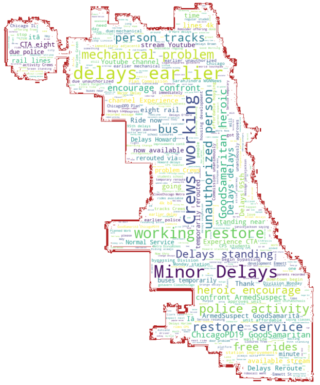

# Sentiment Analysis on @CTA Tweets using Machine Learning Algorithms :smiley: :satisfied: :smirk: :expressionless: :confused: :disappointed: :rage:

## Background

Sentiment analysis is using analytical and machine learning models to classify sentiment of the input sentence as positive or negative.

The goal of this project is to predict people's sentiments over last 10 days about CTA (Chicago Transit Authority) on twitter posts with NLP using  Python library Scikit-Learn.

## Data Source and Models

The code uses the [tweepy](http://www.tweepy.org/) library to access the Twitter API.

We used [Airline Data](Link) obtained from Kaggle to train and test our data using various ML models and compared the score for each models.
First, we convert text data into number vectors using label encoder.
And then, we train vector data and its labels (Positive, Negative or Neutral) using training models.

- The models that we used are:
- Multinomial Naive Bayes
- Complement Naive Bayes
- Bernoulli Naive Bayes
- Decision Tree
- SVM (Support Vector Machine)
- Random Forest Classifier

After comparing each model, we found that SVM gives the maximum score of 78.38 %. So we use SVM on CTA Tweets data to predict the Sentiments.

